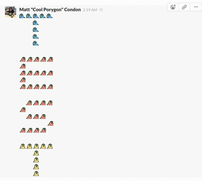

# :partyparrot:



# Usage

## With the Party Parrot (:partyparrot:)

Just pass the script a string of your choosing.

```bash
python partyparrot.py "HELLO" | pbcopy
```

## Custom Emoji List

Use the `-e` or `--emojis` flag to use a custom list of emojis.

```bash
python partyparrot.py "something stupid" -e ":emoji1:" ":emoji2:" ":emoji3:" ":emoji4:" | pbcopy
```

## Auto-Post to Slack

Use the `-f` or `--force` flag to auto-post to your favorite Slack channel (configure URL in the "Incoming Webhooks" section of the "Integrations" page).

```bash
SHITPOSTING_ENDPOINT="<YOUR_SLACK_INCOMING_WEBHOOK_URL>" python partyparrot.py "something stupid" -f
```

## As a Slash Command `/partyparrot`

Now that slack supports posting to the channel in response to a slash command, providing the party parrot as one makes a lot of sense. Simply deploy this app to your favorite Procfile-compatible hosting provider ([heroku](https://heroku.com/) and [dokku](https://github.com/dokku/dokku) come to mind) and configure the Custom Slash Command Integration in your slack channel. The app allows for the optional ENV var `SLACK_TEAM_TOKEN` to restrict access to a specific team.

## Tests

`python test_partyparrot.py`

